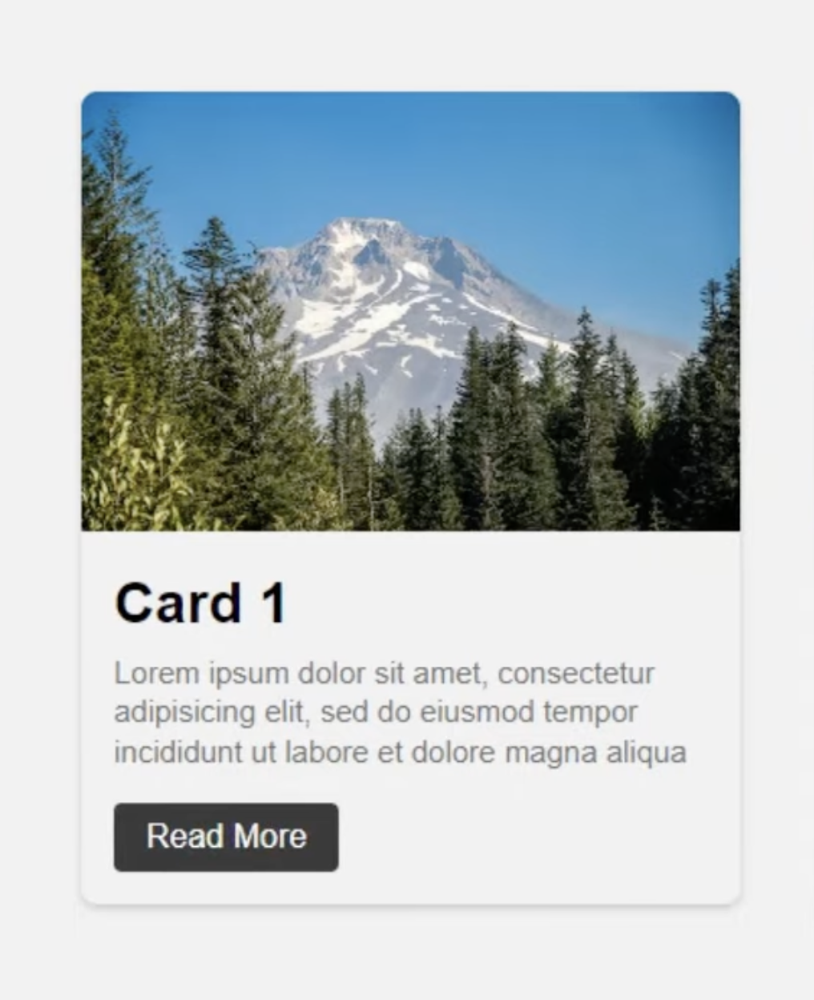
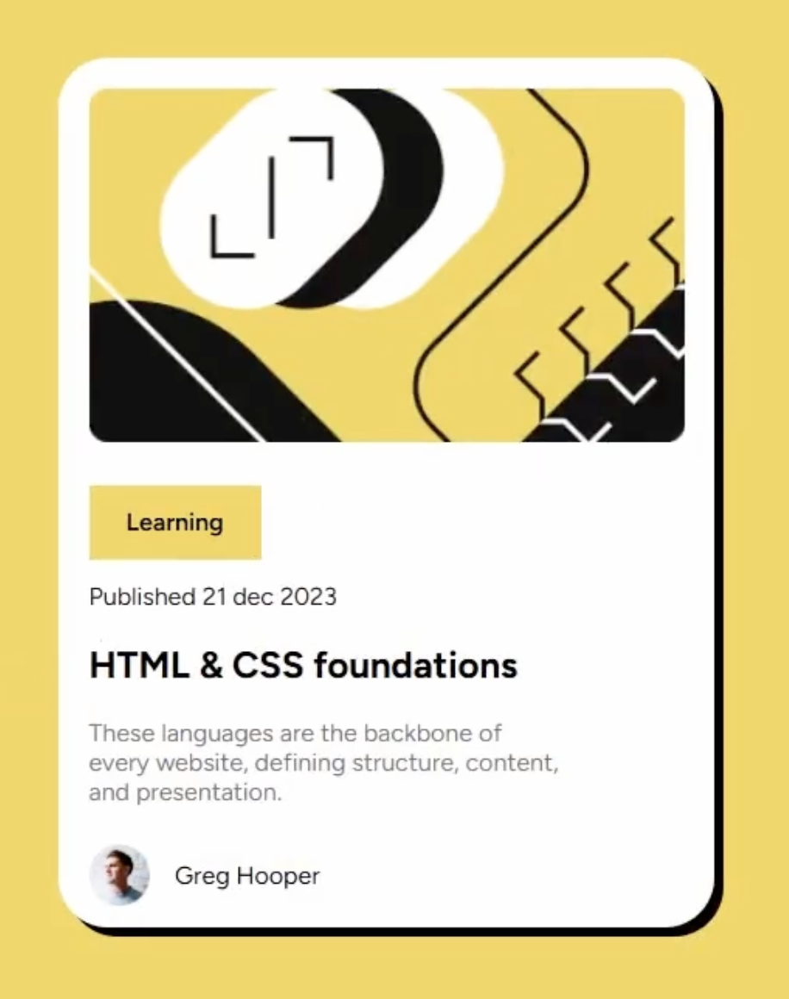

## CSS Card

Build a reusable card component using CSS padding, margin, display, and position.

Create a GitHub repo for this assignment named `is120-hw5-firstname-lastname`.

> Note: I would recommend using `box-sizing: border-box;` for all elements from this point forward to make sizing and spacing easier to manage.

You will have freedom as to what you would like for specific card content and general styling, but ask that your card contain at least the following elements.

- An image
- A title
- A description
- A button or link

Include a `position: absolute;` element on the card.

- This will be something that would naturally break the document flow
- Think of a badge, price tag, icon label, etc. Something that overlaps/ignores the normal layout of the card.
- Your card will need to have `position: relative;` on the card container for this to work properly. We still want the absolute element to be inside the card.

For your card design in general, I would recommend looking at some card examples online for inspiration. Here are a few that I found.

- 
- 
- 

Create a card that you find visually appealing and engaging. Hopefully this is something you could reuse in future projects.

After your card is complete, create 2 additional copies of the card with different content. All cards should share the same `class` names and styles.

- All cards should use `display: inline-block;` on the outside container to ensure they stack nicely next to each other.
- Add an additional `class` or `id` to a single card and add some unique styles to make it stand out

In your `README.md` provide an explanation of the following.

- Where you used `margin` and why;
- Where you used `padding` and why;
- Where you used `display` and why;
- Where you used `position` and why;

Publish using GitHub pages and include the live URL in your repo about section. Submit the GitHub repo URL in LearningSuite.
